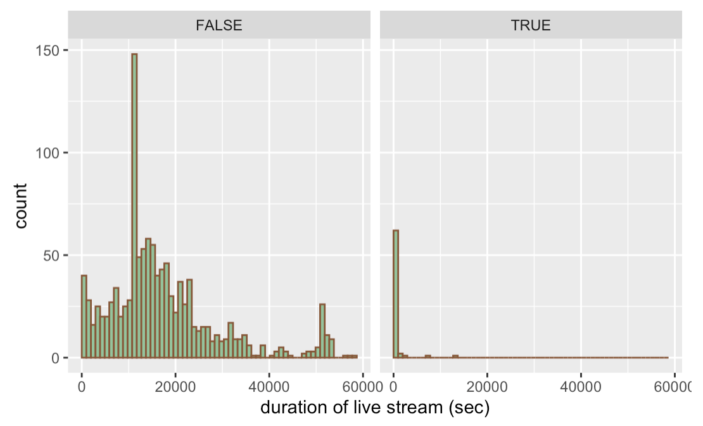

# Missing values

We found there are very interesting patterns in the missing values of "Data_Livestream_General_processed.xlsx". Here is the image we get for all of the missing patterns:

For our purpose of showcasing the missing pattern, we shortened all the column name so that they would not overlap with our function. 

It is noticeable to us that the most common missing pattern is to have Per_customer_transaction, Sales_conversion_value_ratio, Number_of_goods_sold, Number_of_products and Total_sales_amount missing. While this pattern is the most frequent among all the missing patterns, the case where only Per_customer_transaction and Sales_conversion_value_ratio are missing is almost at the same missing frequency.
With this information, we did some exploration to see what are the difference between rows that have valid Per_customer_transaction, Sales_conversion_value_ratio value and those rows that are missing Per_customer_transaction, Sales_conversion_value_ratio. We first looked at the livestram host to see if that column is related to our missing value. 

This image shows the distribution of hosts, with valid Per_customer_transaction, Sales_conversion_value_ratio value (on the left) or not (on the right). We can see that compared to data of other hosts, data for Liu Fang Posture Corrector have a much larger of probability of Per_customer_transaction, Sales_conversion_value_ratio value being null. When we compared the distribution of hosts when consider whether Number_of_goods_sold, Number_of_products and Total_sales_amount missing are missing, the difference in host distribution is not so significant (see image below). 

Thus the frequent missing pattern where Per_customer_transaction, Sales_conversion_value_ratio are missing is related to this host Liu Fang Posture Corrector. After we took a closer look, we found Liu Fang Posture Corrector would host a livestream for a long duration without selling any item. In this case, Per_customer_transaction, Sales_conversion_value_ratio values are null while Number_of_goods_sold, Number_of_products and Total_sales_amount are mostly 0. 

We then looked at the case where all Per_customer_transaction, Sales_conversion_value_ratio, Number_of_goods_sold, Number_of_products and Total_sales_amount are missing and compared the duration of the livestream when Per_customer_transaction, Sales_conversion_value_ratio, Number_of_goods_sold, Number_of_products and Total_sales_amount are missing. 

Here we found that the data with Per_customer_transaction, Sales_conversion_value_ratio, Number_of_goods_sold, Number_of_products and Total_sales_amount missing usually come with low livestream duration. After carefully examination, we found such rows should be the cases when the hosts only stream briefly for testing. 

Similar cases exist when we explore the rows with Average_length_of_stay missing. 

We should also note that these null values shall not be an obstacle to our project as these values are here because they hosts are not selling items or they are selling too few items. The only variable that is missing and is related to our analysis is the Total_sales_amount. For the purpose of our analysis, we will mostly sum the sales amount of live steams in each day together to get the daily revenue, we can drop these rows with missing re during our later process.