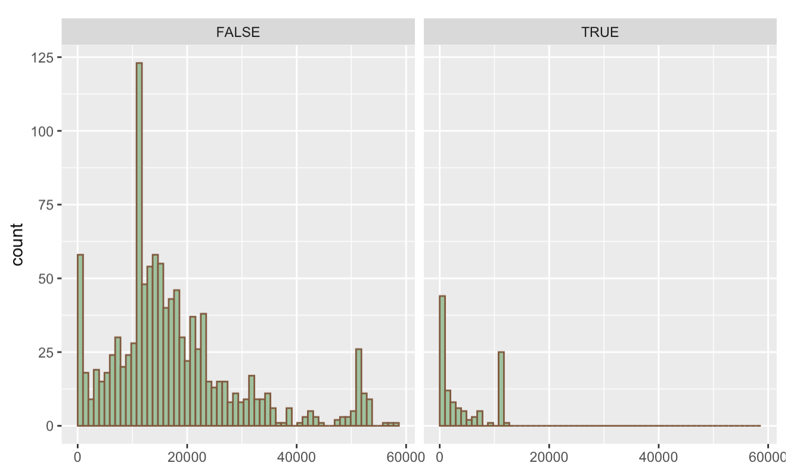
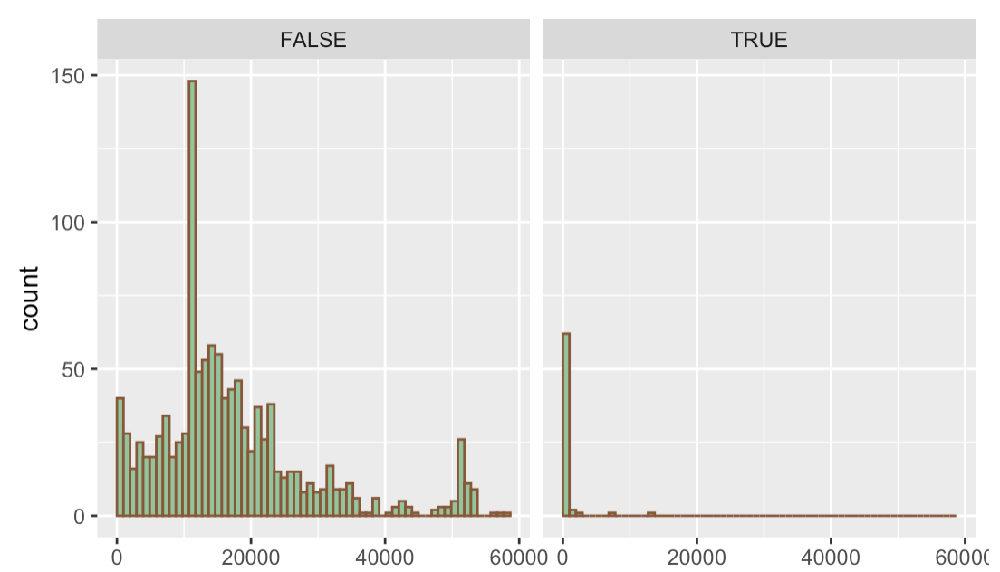

# Missing values

We found there are very interesting patterns in the missing values of "Data_Livestream_General_processed.xlsx". Here is the image we get for all of the missing patterns:

For our purpose of showcasing the missing pattern, we shortened all the column name so that they would not overlap with our function. 

It is noticeable to us that the most common missing pattern is to have CT, CVT, gd, pr and re missing, with these abbreviation stand for transaction_per_customer, sales_conversion_value_rate, number of goods sold, number of type of products and total revenue. While this pattern is the most frequent among all the missing patterns, the case where only CT and CVT are missing is almost at the same missing frequency.
With this information, we did some exploration to see what are the difference between rows that have valid CT, CVT value and those rows that are missing CT, CVT. We first looked at the livestram host to see if that column is related to our missing value. 

This image shows the distribution of hosts, with valid CT and CVT value (on the left) or not (on the right). We can see that compared to data of other hosts, data for Liu Fang Posture Corrector have a much larger of probability of CT and CVT value being null. When we compared the distribution of hosts when consider whether gd, pr and re are missing, the difference in host distribution is not so significant (see image below). 

Thus the frequent missing pattern where CT and CVT are missing is related to this host Liu Fang Posture Corrector. After we took a closer look, we found Liu Fang Posture Corrector would host a livestream for a long duration without selling any item. In this case, CT and CVT values are null while gd, pr and re are mostly 0. 

We then looked at the case where all CT, CVT, gd, pr and re are missing and compared the duration of the livestream when CT, CVT, gd, pr and re are missing. 

Here we found that the data with CT, CVT, gd, pr and re missing usually come with low livestream duration. After carefully examination, we found such rows should be the cases when the hosts only stream briefly for testing. 

Similar cases exist when we explore the rows with LS (average length of stay of viewers) missing. 

We should also note that these null values shall not be an obstacle to our project as these values are here because they hosts are not selling items. Our plan for now would be to delete these rows because they are not related to our questions asked. 
